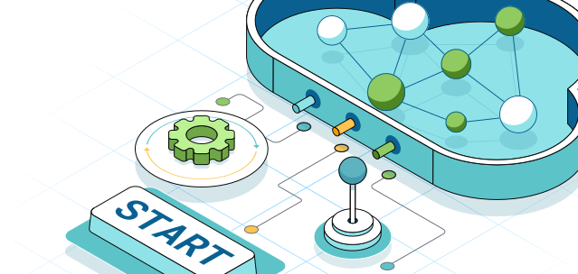
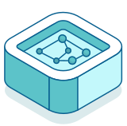
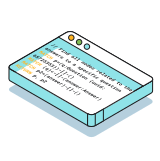
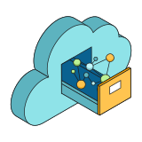
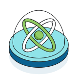
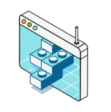
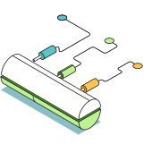

= Neo4j documentation
:page-layout: docs-ndl
:page-role: hub
:page-theme: docs
:page-hide-nav-title: true
:!toc:
:page-toclevels: -1

[.widget.banner.start]
== Getting started

// [.icon]
// 

--
[.caption]
Get started with Neo4j

[.description]
Learn more about graph databases and start working with your data using Neo4j tools.

[.button]
xref:tutorials:index.adoc[Get started]
--

[.cards.icon-l]
== CTA cards

[.featured.label--featured]
=== Deployment options

[.icon]

[.description]
Choose from self-managed local and cloud deployments, or fully-managed options. See how to run Neo4j on Docker or Kubernetes.

=== Cypher

[.icon]

[.description]
Learn how to write Cypher, Neo4j's declarative query language.

[.link]
xref:cypher:index.adoc[Query your data]

=== Neo4j Tools

[.icon]

[.description]
Use Neo4j's tools to explore, visualize, manage, monitor, and import data to your graph.

[.link]
xref:tools:index.adoc[Discover the products]

=== Graph Data Science

[.icon]

[.description]
Run graph algorithms and machine learning models to analyze your data at scale.

[.link]
xref:gds:index.adoc[Unlock insights from data]

=== Create applications

[.icon]

[.description]
Discover the client libraries and APIs to develop applications with Neo4j and AuraDB.

[.link]
xref:create-applications:index.adoc[Start developing]

=== Connect data sources

[.icon]

[.description]
Learn how to use connectors and other tools to connect Neo4j with other data sources.

[.link]
xref:connectors:index.adoc[Connect to Neo4j]

[.widget.lists]
== Tailored for you

[.caption]
Keep exploring

=== Developer

[.icon]

[.list]
* xref:deployment-options:index.adoc[Choose your deployment]
* link:{docs-home}/getting-started/cypher-intro/[Learn Cypher]
* link:{docs-home}/cypher-manual/current/queries/[Start querying]
* link:{docs-home}/create-applications/[Create applications]
* link:{docs-home}/connectors/[Connect data sources]
* xref:genai:index.adoc[Integrate GenAI functions]
* link:{docs-home}/cypher-manual/current/planning-and-tuning/query-tuning/[Improve app performance]
* link:{docs-home}/java-reference[Extend Neo4j]

=== Database Admin

[.icon]

[.list]
* link:{docs-home}/operations-manual/current/database-administration/[Manage your database]
* link:{docs-home}/operations-manual/current/clustering/[Deploy and manage a cluster]
* link:{docs-home}/operations-manual/current/database-internals/[Database internals]
* link:{docs-home}/operations-manual/current/authentication-authorization/[Manage users, roles, and privileges]
* link:{docs-home}/operations-manual/current/monitoring/[Monitor your database]
* link:{docs-home}/operations-manual/current/backup-restore/[Backup and restore]
* link:{docs-home}/upgrade-migration-guide/current/[Upgrade and migration]

=== Data Scientist

[.icon]

[.list]
* link:{docs-home}/graph-data-science/current/getting-started/[Analyze your data]
* link:{docs-home}/graph-data-science/current/production-deployment/[Set up your deployment]
* link:{docs-home}/bloom-user-guide/current/bloom-tutorial/gds-integration/[Create data visualizations]
* link:{docs-home}/graph-data-science/current/machine-learning/machine-learning/[Use machine learning algorithms]
* link:{docs-home}/graph-data-science-client/current/[Set up a Python client]
* link:{docs-home}/graph-data-science/current/management-ops/[Manage your graph]

=== Data Engineer

[.icon]

[.list]
* link:{docs-home}/getting-started/appendix/graphdb-concepts/[Graph database concepts]
* link:{docs-home}/model/[Model your data]
* link:{docs-home}/connectors/[Connect data sources]
* link:{docs-home}/import/[Import your dataset]
* link:{docs-home}/cdc/current/[Monitor data changes]
* link:{docs-home}/getting-started/data-modeling/data-modeling-tools/[Data modeling tools]

[.widget.highlights]
== Tutorials & How-to guides

[.icon]

--
[.caption]
Tutorials & How-to guides

[.list]
* link:{docs-home}/genai/tutorials/embeddings-vector-indexes/[Embedding & Vector Indexes Tutorial]
* link:{docs-home}/getting-started/appendix/tutorials/guide-import-relational-and-etl/[Import data from a relational database into Neo4j]
* link:{docs-home}/getting-started/appendix/tutorials/guide-build-a-recommendation-engine/[Build a Cypher recommendation engine]
* link:{docs-home}/operations-manual/current/tutorial/tutorial-composite-database/[Set up and use a composite database]
* link:{docs-home}/cdc/current/procedures/query-examples/[Capture and track changes in real-time]
* link:{docs-home}/graph-data-science-client/current/tutorials/centrality-algorithms/[Apply centrality algorithms to your graph]

[.footer-link]
xref:tutorials:index.adoc[All tutorials]
--

[.widget.highlights]
== GraphAcademy courses

[.icon]

--
[.caption]
GraphAcademy courses

[.list]
* link:{docs-home}/genai/tutorials/embeddings-vector-indexes/[Embedding & Vector Indexes Tutorial]
* xref:{docs-home}/getting-started/tutorials/import-relational/[Import data from a relational database into Neo4j]
* xref:{docs-home}/getting-started/tutorials/recommendation-engine/[Build a Cypher recommendation engine]
* link:{docs-home}/operations-manual/current/tutorial/tutorial-composite-database/[Set up and use a composite database]
* link:{docs-home}/cdc/current/procedures/query-examples/[Capture and track changes in real-time]
* link:{docs-home}/graph-data-science-client/current/tutorials/centrality-algorithms/[Apply centrality algorithms to your graph]

[.footer-link]
xref:tutorials:index.adoc[All tutorials]
--

[.cards.bottom-cards]
== Other resources

=== Join forums and discussions

[.icon]

[.link]
link:https://community.neo4j.com/[Community forum] 
link:https://discord.com/invite/neo4j[Discord]

=== Dev blogs, articles, and books

[.icon]

[.link]
link:https://neo4j.com/developer-blog/[Developer blog] xref:reference:resources.adoc[Other resources]

// == License

// © 2024 license: link:{docs-home}/license[Creative Commons 4.0]