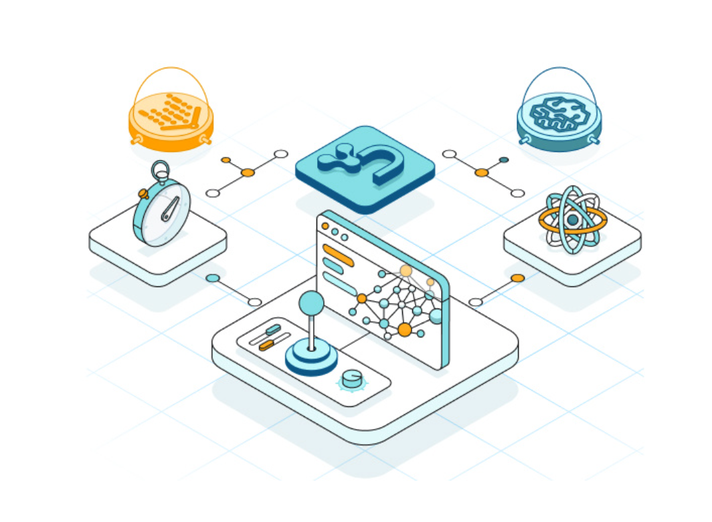

= Neo4j documentation
:page-layout: docs-ndl
:page-theme: docs
:page-show-home-link: true
:page-hide-nav-title: true
// :page-disablefeedback: true
:!toc:
:page-toclevels: -1

[.cards.selectable]
== CTA cards

=== Get started

[.icon]
image:icon-gds.png[]

[.description]
Learn about graph database concepts, introduce yourself to Cypher, and find useful resources.

[.link]
link:{docs-home}/getting-started[Get started]

=== Cypher

[.icon]
image:icon-gds.png[]

[.description]
Learn about graph database concepts, introduce yourself to Cypher, and find useful resources.

[.link]
link:{docs-home}/getting-started[Cypher]

=== Connect your application

[.icon]
image:icon-gds.png[]

[.description]
Learn about graph database concepts, introduce yourself to Cypher, and find useful resources.

[.link]
link:{docs-home}/getting-started[Connect your application]

=== Neo4j Console

[.icon]
// include::partial$neo4j-icon-svg.adoc[]
image:icon-gds.png[]

[.description]
Learn about graph database concepts, introduce yourself to Cypher, and find useful resources.

[.link]
link:{docs-home}/getting-started[Get started]

=== Graph Data Science

[.icon]
// include::partial$neo4j-icon-svg.adoc[]
image:icon-gds.png[]

[.description]
Learn about graph database concepts, introduce yourself to Cypher, and find useful resources.

[.link]
link:{docs-home}/getting-started[Get started]

=== Reference docs

[.icon]
// include::partial$neo4j-icon-svg.adoc[]
image:icon-gds.png[]

[.description]
Learn about graph database concepts, introduce yourself to Cypher, and find useful resources.

[.link]
link:{docs-home}/getting-started[Get started]

[.widget.lists]
== Tailored for you

[.caption]
Tailored for you

=== Developer

[.icon]
image:icons/ndl/query-browser.svg[]

[.list]
* xref:example.com[Learn Cypher]
* xref:example.com[Create applications]
* xref:example.com[Connect data sources]
* xref:example.com[Explore libraries]
* xref:example.com[Integrate GenAI functions]
* xref:example.com[Improve app performance]

=== Database Admin

[.icon]

[.list]
* xref:example.com[Deploy a database]
* xref:example.com[Upgrade and migration]
* xref:example.com[Create a cluster]
* xref:example.com[Set up composite databases]
* xref:example.com[Monitor your databases]
* xref:example.com[Extend database functions]
* xref:example.com[Backup and restore]

=== Data Scientist

[.icon]

[.list]
* xref:example.com[Analyze your data]
* xref:example.com[Create data visualizations]
* xref:example.com[Use machine learning algorithms]
* xref:example.com[Set up a Python client]
* xref:example.com[Manage your graph]

=== Data Engineer

[.icon]

[.list]
* xref:example.com[Import your dataset]
* xref:example.com[Model your data]
* xref:example.com[Graph modeling strategies]
* xref:example.com[Export your results]

[.widget.highlights]
== Tutorials & How-to guides

--
[.caption]
Tutorials & How-to guides

[.list]
* xref:example.com[Apply GenAI to your deployment]
* xref:example.com[Import data from a relational database into Neo4j]
* xref:example.com[Build a Cypher recommendation engine]
* xref:example.com[Explore libraries]
* xref:example.com[Set up and use a composite database]
* xref:example.com[Capture and track changes in real-time]

[.footer-link]
xref:example.com[All tutorials]
--

[.icon]

[.cards.icon-s.align-center]
== Other resources

=== Learn and become Neo4j certified

[.icon]

[.link]
link:{docs-home}/getting-started[Explore Graph Academy]

=== Join forums and discussions

[.icon]

[.link]
link:{docs-home}/getting-started[Neo4j community]

// === Developer blogs, articles and books

// [.icon]
// 

// [.link]
// link:{docs-home}/getting-started[Developer center]

// == License

// © 2021 license: link:{docs-home}/license[Creative Commons 4.0]