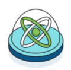

= What is Neo4j?
:page-layout: docs-ndl
:page-theme: docs
:page-role: explainer
:page-show-home-link: true
:page-hide-nav-title: true
// :page-disablefeedback: true
:page-toclevels: 1

ifndef::backend-pdf[]
++++

<iframe width="680" height="425" src="https://www.youtube.com/embed/urO5FyP9PoI" title="YouTube video player" frameborder="0" allow="accelerometer; autoplay; clipboard-write; encrypted-media; gyroscope; picture-in-picture" allowfullscreen></iframe>

++++
endif::[]

[.cards.selectable]
== Ecosystem

In imperdiet ex eget mi fermentum, sed egestas tortor interdum.
Aliquam vehicula nisl non pharetra suscipit.
Nulla tortor sapien, eleifend non magna nec, auctor cursus velit.
Phasellus in purus massa.
Sed maximus tortor et viverra lacinia.
Nullam fermentum purus at odio rutrum semper.
Nunc lacinia, ipsum sed pharetra luctus, orci magna condimentum enim, sit amet condimentum nunc sem at lorem.

=== Cypher Query Language

[.icon]

[.description]
Phasellus in purus massa.
Sed maximus tortor et viverra lacinia.
Nullam fermentum purus at odio rutrum semper.

[.link]
link:{docs-home}/cypher-manual[]

=== Drivers and connectors

[.icon]

[.description]
Phasellus in purus massa.
Sed maximus tortor et viverra lacinia.
Nullam fermentum purus at odio rutrum semper.

[.link]
link:{docs-home}/connectors[]

=== Neo4j Tools

[.icon]

[.description]
Phasellus in purus massa.
Sed maximus tortor et viverra lacinia.
Nullam fermentum purus at odio rutrum semper.

[.link]
link:{docs-home}/connectors[]

[.next-steps]
== Start exploring

Lorem ipsum dolor sit est.

. *Tutorial: Getting started with Cypher*
+ 
Learn stuff
. *Working with data sets*
+
Learn stuff
. *Step 3 goes here*
+
Some more

//-

// Tutorial: Getting started with Cypher:: Learn stuff
// Working with data sets:: Learn stuff
// Step 3 goes here:: Some more