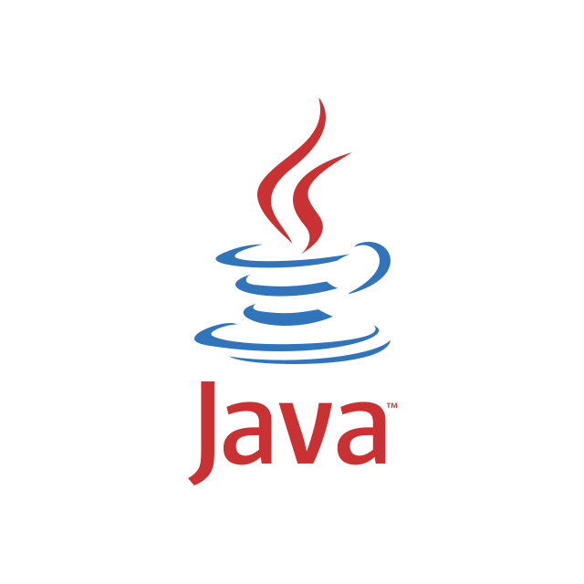
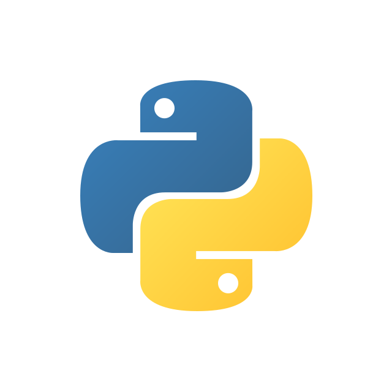
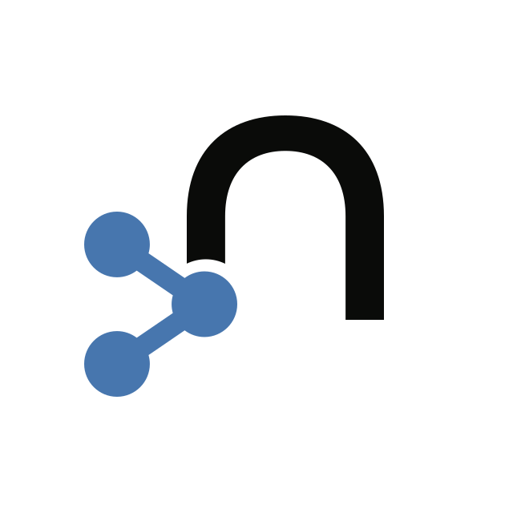
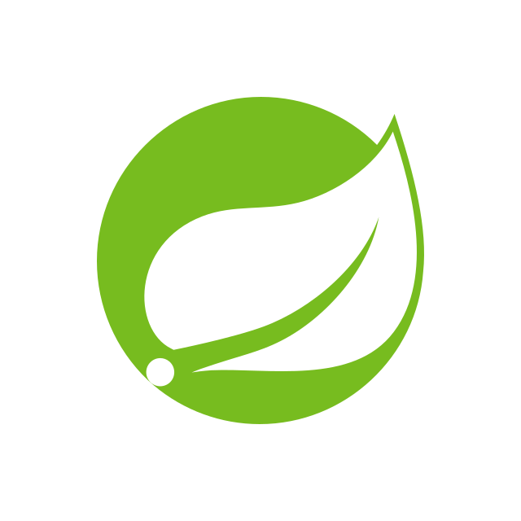

[.drivers-apis]
= Neo4j documentation - Drivers and APIs
:page-layout: docs-home
:page-theme: docs
:!toc:
:page-toclevels: -1

[.display]
== Neo4j Drivers

=== Neo4j Go Driver documentation

[.category]
Neo4j Driver

[.icon]

[.link]
link:{docs-home}/go-manual[Get started]

=== Neo4j Java Driver documentation

[.category]
Neo4j Driver

[.icon]

[.link]
link:{docs-home}/java-manual[Get started]

=== Neo4j JavaScript Driver documentation

[.category]
Neo4j Driver

[.icon]

[.link]
link:{docs-home}/javascript-manual[Get started]

=== Neo4j Python Driver documentation

[.category]
Neo4j Driver

[.icon]

[.link]
link:{docs-home}/python-manual[Get started]

=== Neo4j .NET Driver documentation

[.category]
Neo4j Driver

[.icon]

[.link]
link:{docs-home}/dotnet-manual[Get started]

[.display]
== APIs and connectors

=== Neo4j GraphQL Library documentation

[.category]
Neo4j GraphQL Library

[.icon]
image:graphql-logo.svg[]

[.link]
link:{docs-home}/graphql-manual[Get started]

=== Neo4j HTTP API documentation

[.category]
Neo4j API

[.icon]

[.link]
link:{docs-home}/http-api[Get started]

=== Neo4j-OGM documentation

[.category]
Object Graph Mapping

[.icon]

[.link]
link:{docs-home}/ogm-manual[Get started]

=== Spring Data Neo4j documentation

[.category]
Spring Data Neo4j

[.icon]

[.link]
link:https://docs.spring.io/spring-data/neo4j/docs/current/reference/html/[Get started]

=== Neo4j Connector for Apache Spark documentation

[.category]
Apache Spark connector

[.icon]
image:Apache_Spark_logo.svg[]

[.link]
link:{docs-home}/spark/current[Get started]
