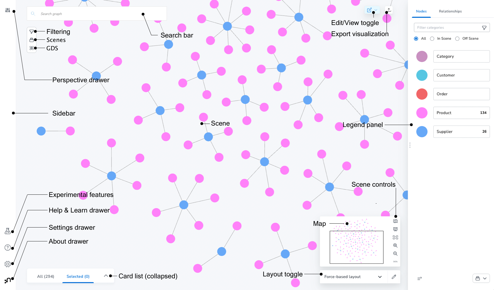

= Image display options
:page-theme: docs
// :page-styles: image-border

[abstract]
--
Display images with border or box-shadow
--

- set `:page-styles: image-border` or `:page-styles: image-shadow` in a playbook, _antora.yml_ or in a page header to add border or shadow to all pages in the docset, component, or page.
- set `[.border]` or `[.shadow]` for individual images
- combine border and shadow settings to apply both styles
- use `[.no-border]` or `[.no-shadow]` to override a global setting for a specific image

== Border

Lorem ipsum dolor sit amet, consectetur adipiscing elit.
Mauris eget leo nunc, nec tempus mi? Curabitur id nisl mi, ut vulputate urna.
Quisque porta facilisis tortor, vitae bibendum velit fringilla vitae! Lorem ipsum dolor sit amet, consectetur adipiscing elit.

----
[.border]

----

[.border]

Mauris eget leo nunc, nec tempus mi? Curabitur id nisl mi, ut vulputate urna.
Quisque porta facilisis tortor, vitae bibendum velit fringilla vitae!

== Shadow

Mauris eget leo nunc, nec tempus mi? Curabitur id nisl mi, ut vulputate urna.
Quisque porta facilisis tortor, vitae bibendum velit fringilla vitae!

----
[.shadow]

----

[.shadow]

Mauris eget leo nunc, nec tempus mi? Curabitur id nisl mi, ut vulputate urna.
Quisque porta facilisis tortor, vitae bibendum velit fringilla vitae!

== Border and shadow

Mauris eget leo nunc, nec tempus mi? Curabitur id nisl mi, ut vulputate urna.
Quisque porta facilisis tortor, vitae bibendum velit fringilla vitae!

----
[.border.shadow]

----

[.border.shadow]

Mauris eget leo nunc, nec tempus mi? Curabitur id nisl mi, ut vulputate urna.
Quisque porta facilisis tortor, vitae bibendum velit fringilla vitae!

== No styles

Mauris eget leo nunc, nec tempus mi? Curabitur id nisl mi, ut vulputate urna.
Quisque porta facilisis tortor, vitae bibendum velit fringilla vitae!

Mauris eget leo nunc, nec tempus mi? Curabitur id nisl mi, ut vulputate urna.
Quisque porta facilisis tortor, vitae bibendum velit fringilla vitae!