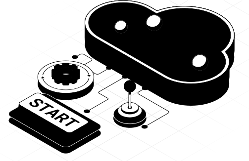

= Tell us what we could do better
:page-layout: docs-ndl
:page-theme: research
:!toc:
:page-toclevels: -1

[.widget.banner]
== What is User Research at Neo4j?

// [.icon]
// 

--
[.caption]
What is User Research at Neo4j?

[.description]
We believe that understanding our users is the key to delivering a great product. 
Our goal is to make Neo4j front-end products user friendly, match your needs and enable your success, whether you are a new or long-term user.

[.button]
link:https://p.consentkit.com/baf41f1b-7816-4e04-82a7-b4c6d93ddf19[*Sign up to research panel*]
--

[.cards.bottom-cards]

[.next-steps]
== How does it work?

=== How does it work?

. *Sign up* +
[.description]
Sign up to let us know about your experience with Neo4j and your user profile.
[.link]
link:https://p.consentkit.com/baf41f1b-7816-4e04-82a7-b4c6d93ddf19[*Sign me up*]

. *Get contacted by researcher* +
Based on your profile you might be contacted to participate in interviews, product walkthroughs, user tests, and surveys.

. *Sign the consent form* +
Before a research session, we need to know that you agree to take part in it. We will account for your privacy and rights in the agreement.

. *Attend the research session* +
Interviews take 30-60 min. You might be asked to share your screen to show us how you use Neo4j, test a prototype, or a new feature.
All research activities take place remotely via Google Meet or Zoom.

. *Get rewarded* +
You will be compensated for your time and effort.

=== FAQs 

[.faq-item]
*What is a user research panel?*
[.faq-answer]
A user research panel is a group of users who have signed up to participate in research studies. 
These studies help us understand how people use our products so we can improve them.

[.faq-item]
*What will you do with my personal information?*
[.faq-answer]
Your personal information will only be used for research purposes. 
We will never share your data with third parties, and all responses will be anonymized before being analyzed and shared internally.

[.faq-item]
*How often will I be asked to participate?*
[.faq-answer]
We may contact you a few times a year, depending on the research needs and how well your profile matches a particular study. 
You can always opt-out or decline participation at any time.

[.faq-item]
*Can I leave the panel if I no longer wish to participate?*
[.faq-answer]
Yes, you can opt out of the panel at any time. 
Simply contact us by email and we will remove your information from our research panel database.

[.faq-item]
*I have some feedback but I prefer to send it in an email.*
[.faq-answer]
We welcome your feedback  - what works well, what’s confusing, and what improvements you’d like to see. Please email us at user-research@neo4j.com. 
We will reach you if we need more clarification or we may invite you to an interview.

&nbsp;

